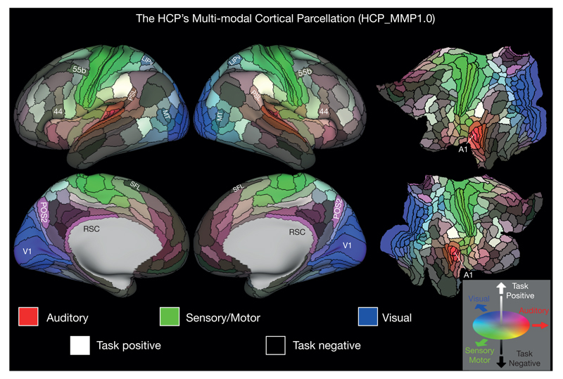
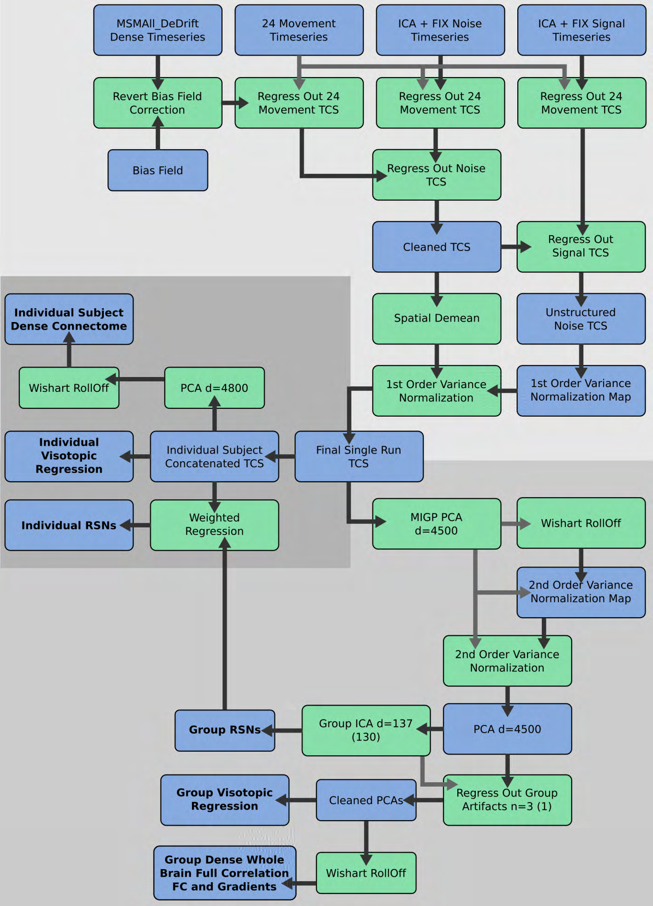
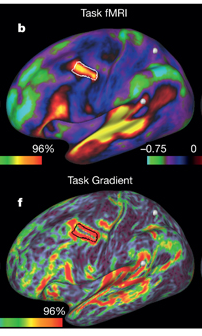

## OHBM 2017 Themes:

- high-resolution, high-throughput, multi-site
- multi-modal
- connectivity (mostly functional)
- parcellation
- graph-theoretic methods
- machine learning
- reproducible research

## Why this paper?
- touches on most of these themes
- cited by many papers (210 so far) and OHBM talks/posters
- potential future directions?

## Main Result

- A new parcellation (atlas) of the human cortex that better summarizes
functional and structural homogeneity.
- 180 parcels per hemisphere
- 97 previously undescribed

---

\centering 

## Why parcellation?

- human-comprehensible
- cross-study comparison
- increases statistical power **(citation?)**

## Human Connectome Project (HCP)

> "ambitious effort to map the neural pathways that underlie human brain function. The overarching purpose of the Project is to acquire and share data about the structural and functional connectivity of the human brain"

- multi-site: WU/Minn/Oxford, 9+ other institutions
- high-throughput (for people)
- HCP protocol: T1w, T2w, DTI, b0 field maps, rfMRI, tfMRI, EEG, MEG
- high-resolution (0.7mm iso. structural, 2mm functional)

## Overview

>- Acquire multi-modal data
>- Perform multi-modal surface registration (MSMAll)
>- Compute structural and connectivity surface gradients
>- Use gradients and literature data to delineate boundaries
>- Optimize boundary locations with **"algorithms"**
>- Name new cortical parcels
>- Train a neural network to classify voxels based on multi-modal information \
\ \ - \small{parcellate new subjects without repeating semi-automated approach }\
\ \ - \small{identify regions where topology is not conserved (registration: preserves topology)}
>- Test statistical behaviour of original multi-modal parcellation approach and classifier

## Preprocessing

- Surface creation
- Generate myelin maps as T1w/T2w images
- ICA denoise
- Residualization of fMRI

---

\centering 

\color{red} \large This will be on the test

## MSMAll

- Non-linear 2D registration on the sphere
  (Markov Random Field discrete registration)
- Traditionally depth information is the only modality used
- Gentle sulcal alignment, followed by myelin/function connectivity (!!) alignment

- TODO: this and the following slide are redundant

## What Gets Registered

- Sulcal Depth (initial 'gentle' registration)
- Individual myelin maps
- Individual connectome ICA components
- Visuotopic connectivity maps

## Gradients

- What is they?

---

\centering 

## Gradients

- What is they?
- How have we already used them for years?

## Gradients

- What is they?
- How have we already used them for years?
- How does a functional gradient work?

## Boundary Finding

- Glasser and Van Essen manually delineated boundaries according
to gradients and a literature survey
- Manual boundaries were optimized within a search fringe to
both smooth the boundaries and constrain them to high gradient regions

## Questions so far \ldots

- Voxel vs region? <!-- why do we do analyses both ways, which do we trust if they conflict -->
- Principled preprocessing? 
- Too complex? 
- Automated approach to boundary finding?
- Functionally defined parcels/registration?
- 2D vs. 3D registration (or, why give up layers)?
- Not enough modalities? (histology?)
- Not meaningful parcels?  (Not necessarily 'consensus' boundaries, averaging, not clear where to put boundaries...)

---

\centering 

## Questions so far \ldots

- Voxel vs region? <!-- why do we do analyses both ways, which do we trust if they conflict -->
- Principled preprocessing?
- Too complex?
- Automated approach to boundary finding?
- Functionally defined parcels/registration?
- 2D vs. 3D registration (or, why give up layers)?
- Not enough modalities? (histology, others?)
- Not meaningful parcels?  (Not necessarily consensus boundaries, averaging, not clear where to put boundaries...)

## Parcel Classification

- Why can't we just register?
- What is it
- How does it work
- How was it trained

## Validation

- Training and test sets
- Performance measures
- Was it enough?

## Final Thoughts

- Too much hype? Not enough?
- Should we be doing this with mice?  How?
